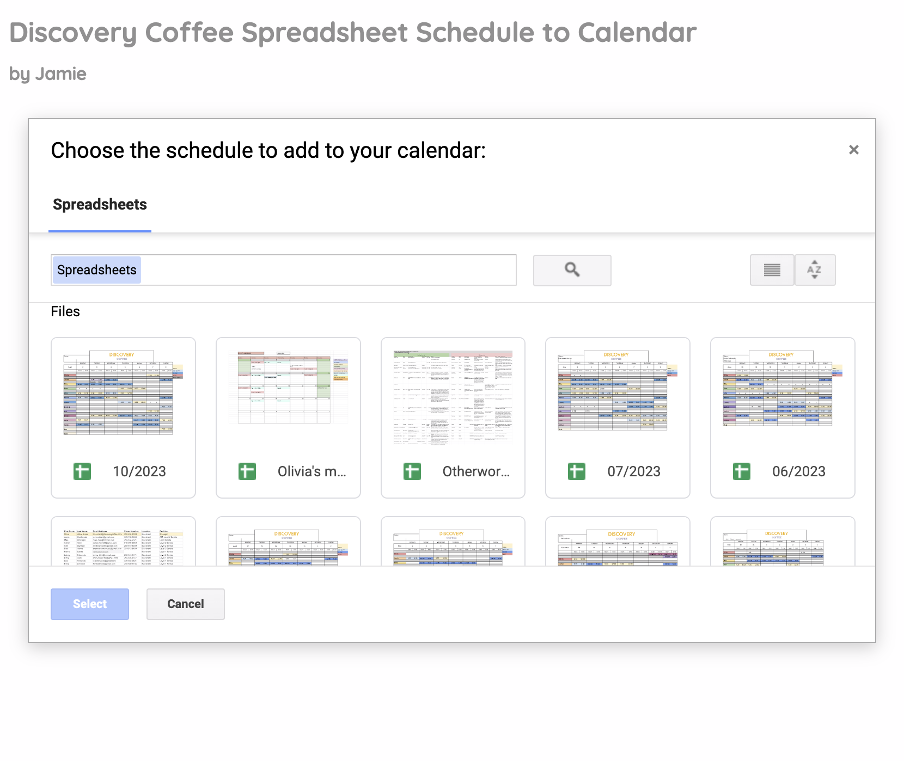
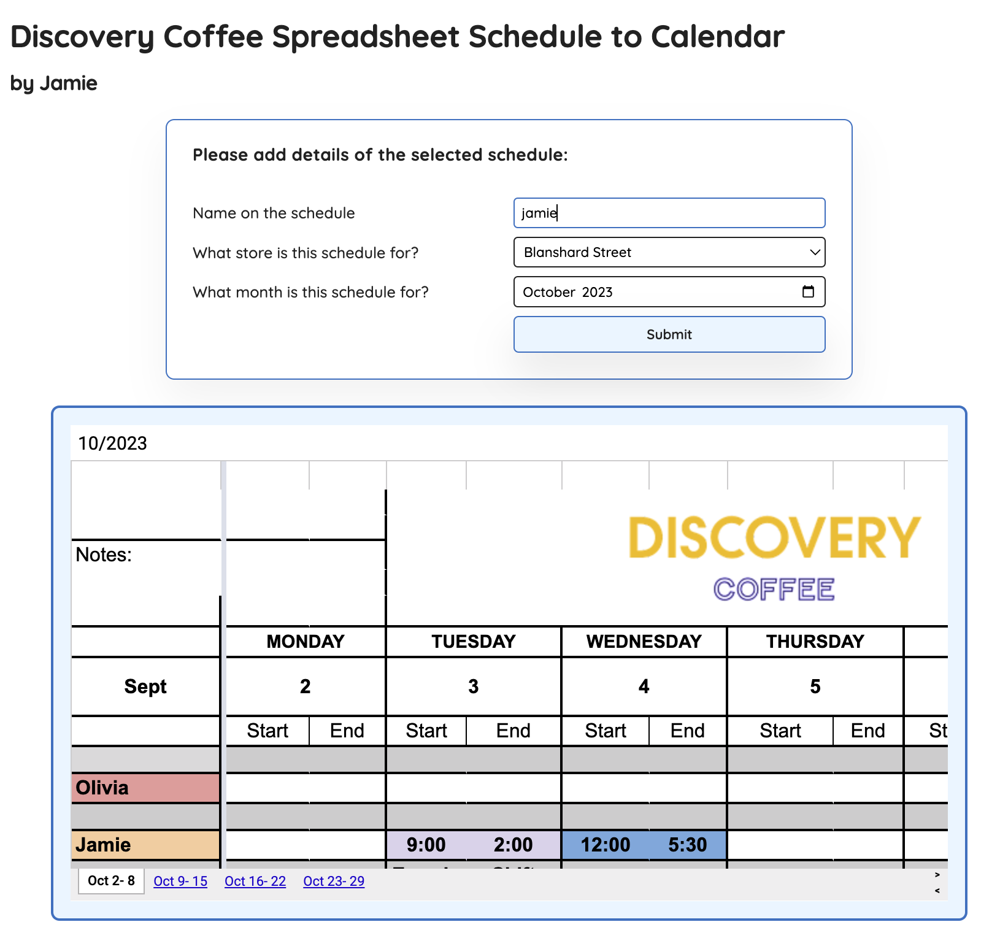
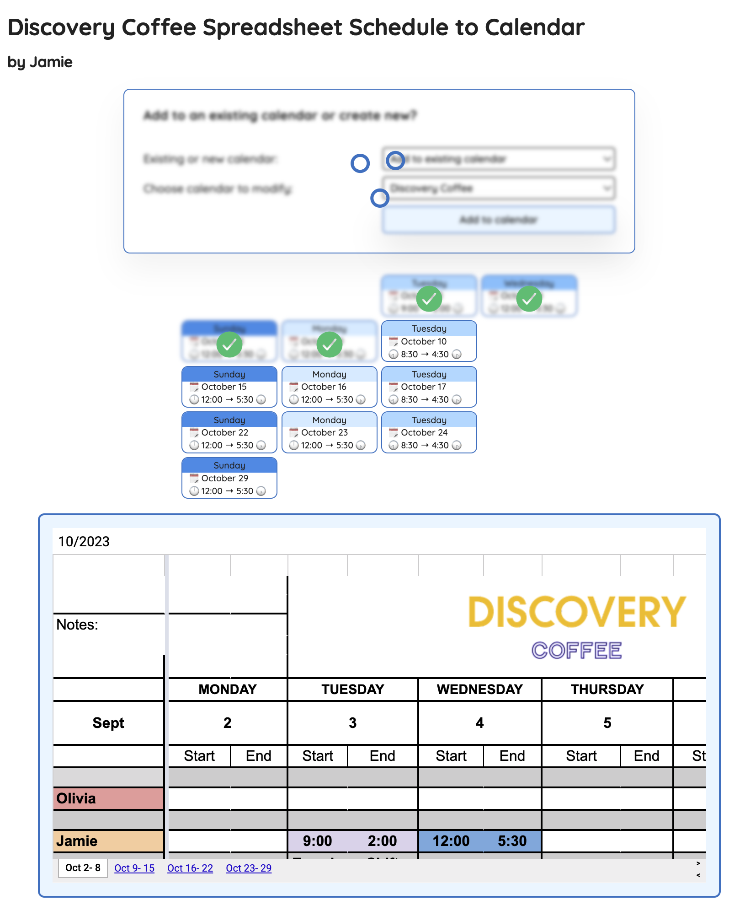

# discovery schedule to calendar

A little web app I made to parse a Google spreadsheet schedule and
automatically add it to my calendar for the coffee shop where I work.

It's not public to use right now since it would need to be verified by Google,
but it's hosted [here][1]

This turned into a beginner learning project for me to learn react while
dealing with real Google apis and oauth token handling.

[1]: https://sidequestboy.com/discovery-schedule-to-calendar
